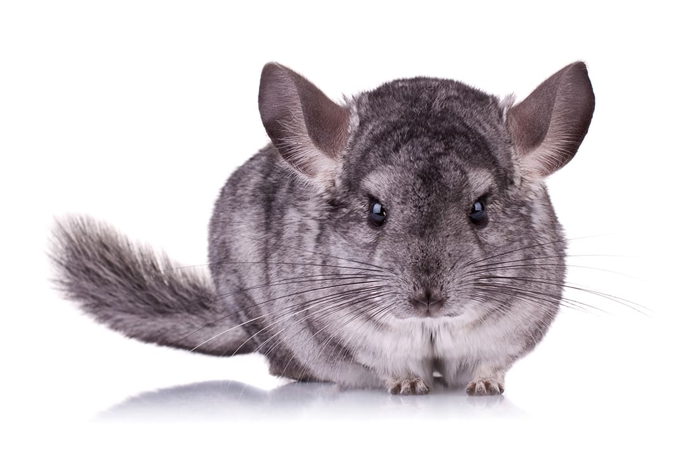

# Chinchilla RPC Proxy



## Context

We currently only support JSON-RPC requests for marketplace add-ons. This requires potential
marketplace partners to support a JSON-RPC API. Partners who do not currently support JSON-RPC
will require support for it or could run a simple proxy which will translate documented JSON-RPC
requests to their REST based upstream API. The idea of this repo is to provide that service.

### Features

- [x] support REST API methods via camelCaseFormated `method` argument
- [x] support GET/POST/DELETE/etc REST requests via `method` param
- [x] support additional URL path argument via `path` param
- [x] support additional URL arguments via extra params (outside of `path` and `method`)
- [ ] return upstream API response wrapped in JSON-RPC response
- [ ] deal with upstream API HTTP response headers
- [ ] avoid any log.Fatal (in request handler path)

## Example requests

Based on https://docs.gopluslabs.io/reference/quick-start

Simple GET based upstream request with no arguments:

```
curl -v http://localhost:8080  -X POST \
  -H "Content-Type: application/json" \
  --data '{"method":"gopluslabs_supportedChains","params":[],"id":1,"jsonrpc":"2.0"}'
```

Get request with path argument and URL arguments:

```
curl -v http://localhost:8080  -X POST \
  -H "Content-Type: application/json" \
  --data '{"method":"gopluslabs_addressSecurity","params":[{"path":"0x71C7656EC7ab88b098defB751B7401B5f6d8976F","chain_id":"3"}],"id":1,"jsonrpc":"2.0"}'
```
